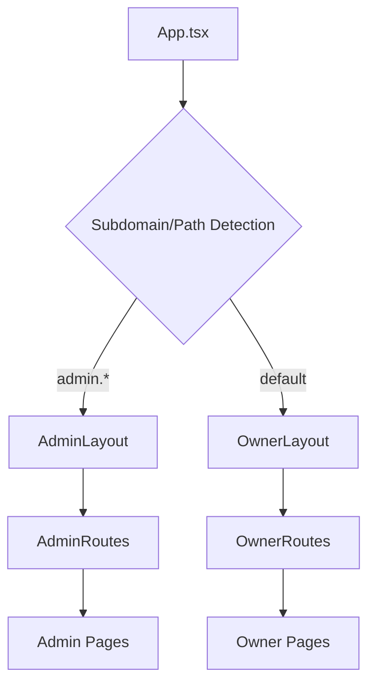
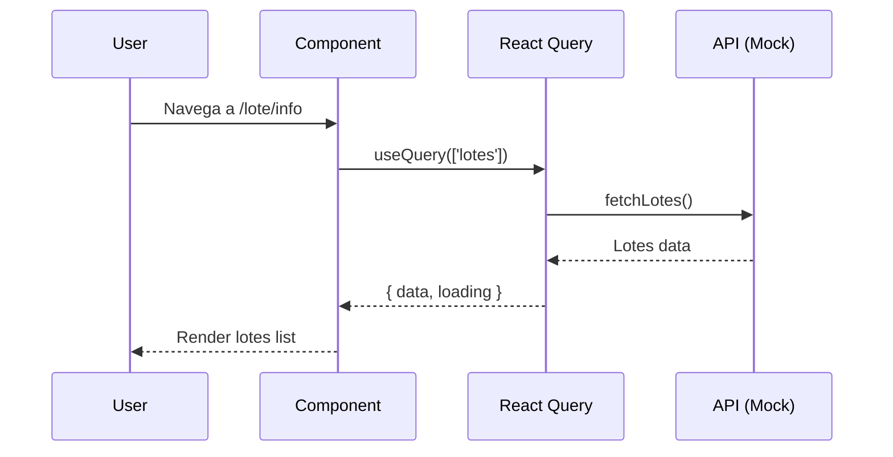
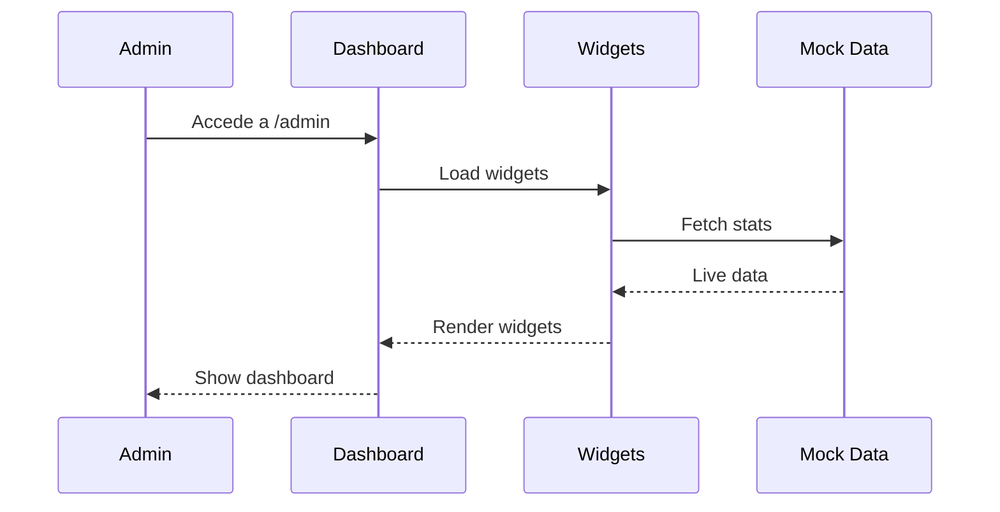

# Arquitectura Técnica - Sistema Bahía de los Moros

## 🏛️ Visión General de la Arquitectura

### Patrón de Diseño: Dual Application Architecture


### Detección de Contexto (App.tsx)
```typescript
const getSubdomain = () => {
  const hostname = window.location.hostname;
  const parts = hostname.split('.');
  if (parts.length > 2) {
    return parts[0]; // Return first part as subdomain
  }
  return null;
};

const isAdminAccess = () => {
  const subdomain = getSubdomain();
  const pathname = window.location.pathname;
  return subdomain === 'admin' || pathname.startsWith('/admin');
};
```

## 🎭 Layouts y Estructura

### OwnerLayout.tsx
```tsx
// Layout para propietarios
<SidebarProvider>
  <div className="min-h-screen flex w-full bg-background">
    <OwnerSidebar />
    <div className="flex-1 flex flex-col">
      <header>Portal del Propietario</header>
      <main><OwnerRoutes /></main>
    </div>
  </div>
</SidebarProvider>
```

### AdminLayout.tsx
```tsx
// Layout para administración
<SidebarProvider>
  <div className="min-h-screen flex w-full bg-background">
    <AdminSidebar />
    <div className="flex-1 flex flex-col">
      <header>Sistema de Administración</header>
      <main><AdminRoutes /></main>
    </div>
  </div>
</SidebarProvider>
```

## 🛣️ Sistema de Rutas

### OwnerRoutes.tsx - Rutas del Propietario
```typescript
const ownerRoutes = {
  // Dashboard
  '/': 'Dashboard',
  '/dashboard': 'Dashboard',
  
  // Mi Lote
  '/lote/info': 'LoteInfo',
  '/lote/planos': 'LotePlanosDocumentos',
  '/lote/historial': 'LoteHistorialCompleto',
  
  // Pagos
  '/pagos/estado': 'CanonEstado',
  
  // Reservas
  '/reservas/espacios': 'ReservasEspacios',
  '/reservas/mis-reservas': 'ReservasMisReservas',
  
  // Autorizaciones
  '/autorizaciones/nueva': 'AutorizacionesNueva',
  '/autorizaciones/lista': 'AutorizacionesLista'
}
```

### AdminRoutes.tsx - Rutas de Administración
```typescript
const adminRoutes = {
  // Dashboard
  '/admin': 'AdminDashboard',
  '/admin/dashboard': 'AdminDashboard',
  
  // Usuarios
  '/admin/usuarios/staff': 'UsuariosStaff',
  '/admin/usuarios/autorizados': 'UsuariosAutorizados',
  '/admin/usuarios/permisos': 'AdminUsuariosPermisos',
  
  // ABM
  '/admin/lotes/abm': 'LotesABM',
  '/admin/espacios/abm': 'EspaciosComunesABM',
  
  // Análisis
  '/admin/fuel': 'FuelAnalysis',
  '/admin/machinery': 'MachineryAnalysis',
  '/admin/common-spaces': 'CommonSpacesAnalysis',
  
  // Sistema
  '/admin/monitoreo': 'AdminMonitoreo',
  '/admin/reportes': 'AdminReportes',
  '/admin/eficiencia': 'AdminEficiencia',
  '/admin/config/apis': 'AdminConfigAPIs',
  '/admin/config/sistema': 'AdminConfigSistema',
  '/admin/activity': 'ActivityLog'
}
```

## 🧩 Arquitectura de Componentes

### Jerarquía de Componentes
```
App
├── QueryClientProvider
├── TooltipProvider
├── BrowserRouter
└── Layout (Owner/Admin)
    ├── Sidebar (Owner/Admin)
    ├── Header
    └── Main Content (Routes)
        ├── Pages
        ├── Widgets
        └── Modals
```

### Componentes UI Base (shadcn/ui)
```typescript
// Componentes primitivos
- Button, Card, Badge, Input, Select
- Dialog, Sheet, Popover, Tooltip
- Table, Tabs, Accordion, Collapsible
- Calendar, Progress, Slider, Switch
- Avatar, Alert, Breadcrumb, Separator
```

### Widgets Especializados
```typescript
// Widgets reutilizables
export interface WidgetProps {
  title?: string;
  expandable?: boolean;
  expandUrl?: string;
  className?: string;
  children: ReactNode;
}

// Ejemplos:
- TideWidget: Información climática y mareas
- MachineryHoursWidget: Horas de uso de maquinaria  
- SecurityCameras: Grid de cámaras de seguridad
- ActivityFeed: Feed de actividades en tiempo real
- ExpandableWidget: Contenedor genérico expandible
```

### Modales de Detalle
```typescript
// Patrón de modales reutilizables
interface DetailModalProps {
  isOpen: boolean;
  onClose: () => void;
  data: EntityData;
}

// Implementaciones:
- LoteDetailModal: Detalles de lotes
- UserDetailModal: Información de usuarios
- StaffDetailModal: Perfiles de empleados
```

## 📊 Gestión de Estado

### TanStack React Query
```typescript
// Cliente de queries global
const queryClient = new QueryClient({
  defaultOptions: {
    queries: { staleTime: 5 * 60 * 1000 }, // 5 minutos
    mutations: { onError: handleGlobalError }
  }
});

// Ejemplo de uso en componentes
const { data: lotes, isLoading } = useQuery({
  queryKey: ['lotes', ownerId],
  queryFn: () => fetchLotesByOwner(ownerId)
});
```

### Estado Local con useState
```typescript
// Estados de UI locales
const [isExpanded, setIsExpanded] = useState(false);
const [selectedLote, setSelectedLote] = useState<Lote | null>(null);
const [filters, setFilters] = useState<FilterState>(defaultFilters);
```

## 🎨 Sistema de Diseño

### Tokens de Diseño (index.css)
```css
:root {
  /* Colors - HSL Format */
  --background: 0 0% 100%;
  --foreground: 222.2 84% 4.9%;
  --primary: 221.2 83.2% 53.3%;
  --secondary: 210 40% 96%;
  
  /* Semantic Colors */
  --success: 142.1 76.2% 36.3%;
  --warning: 47.9 95.8% 53.1%;
  --destructive: 0 84.2% 60.2%;
  
  /* Spacing & Typography */
  --radius: 0.5rem;
  --font-family: 'Inter', sans-serif;
}
```

### Utilidades Tailwind
```typescript
// tailwind.config.ts
export default {
  content: ['./src/**/*.{ts,tsx}'],
  theme: {
    extend: {
      colors: {
        border: 'hsl(var(--border))',
        background: 'hsl(var(--background))',
        foreground: 'hsl(var(--foreground))',
        primary: {
          DEFAULT: 'hsl(var(--primary))',
          foreground: 'hsl(var(--primary-foreground))'
        }
      }
    }
  }
}
```

## 🔄 Flujo de Datos

### Owner Portal Flow


### Admin Dashboard Flow


## 🛡️ Seguridad y Permisos

### Separación de Contextos
```typescript
// Detección automática de contexto
const isOwnerContext = !window.location.hostname.includes('admin') 
  && !window.location.pathname.startsWith('/admin');

// Layout condicional
{isOwnerContext ? <OwnerLayout /> : <AdminLayout />}
```

### Rutas Protegidas (Preparado para Auth)
```typescript
// Estructura preparada para autenticación
const ProtectedRoute = ({ children, requiredRole }) => {
  const { user, role } = useAuth(); // To implement
  
  if (!user) return <Navigate to="/login" />;
  if (role !== requiredRole) return <Navigate to="/unauthorized" />;
  
  return children;
};
```

## 📱 Responsive Design Strategy

### Breakpoints
```css
/* Tailwind breakpoints */
sm: '640px'   // Tablet portrait
md: '768px'   // Tablet landscape  
lg: '1024px'  // Desktop
xl: '1280px'  // Large desktop
2xl: '1536px' // Extra large
```

### Layout Adaptativo
```typescript
// Hook para detección de móvil
const { isMobile } = useMobile();

// Sidebar colapsable
<SidebarProvider defaultOpen={!isMobile}>
  <Sidebar collapsible="icon">
    {/* Sidebar content */}
  </Sidebar>
</SidebarProvider>
```

## 🚀 Build y Deployment

### Vite Configuration
```typescript
// vite.config.ts
export default defineConfig({
  plugins: [react()],
  resolve: {
    alias: { '@': path.resolve(__dirname, './src') }
  },
  build: {
    outDir: 'dist',
    sourcemap: true,
    rollupOptions: {
      output: {
        manualChunks: {
          vendor: ['react', 'react-dom'],
          ui: ['@radix-ui/react-dialog', '@radix-ui/react-popover']
        }
      }
    }
  }
});
```

### Environment Variables (Preparado)
```typescript
// Para integración futura
interface ImportMetaEnv {
  readonly VITE_SUPABASE_URL: string;
  readonly VITE_SUPABASE_ANON_KEY: string;
  readonly VITE_API_BASE_URL: string;
}
```

## 🔧 Patrones de Desarrollo

### Custom Hooks Pattern
```typescript
// Hooks reutilizables
export const useLotes = (ownerId: string) => {
  return useQuery({
    queryKey: ['lotes', ownerId],
    queryFn: () => fetchLotesByOwner(ownerId),
    enabled: !!ownerId
  });
};

export const useReservas = () => {
  const queryClient = useQueryClient();
  
  return useMutation({
    mutationFn: createReserva,
    onSuccess: () => {
      queryClient.invalidateQueries({ queryKey: ['reservas'] });
    }
  });
};
```

### Component Composition Pattern
```typescript
// Componentes composicionales
<ExpandableWidget expandUrl="/admin/fuel" expandText="ver más">
  <Card>
    <CardHeader>
      <CardTitle>Tanques de Combustible</CardTitle>
    </CardHeader>
    <CardContent>
      {/* Content */}
    </CardContent>
  </Card>
</ExpandableWidget>
```

### Form Handling Pattern
```typescript
// React Hook Form + Zod
const schema = z.object({
  nombre: z.string().min(1, 'Nombre requerido'),
  email: z.string().email('Email inválido'),
  loteNumero: z.number().min(1).max(500)
});

const form = useForm<FormData>({
  resolver: zodResolver(schema),
  defaultValues: { nombre: '', email: '', loteNumero: 0 }
});
```

## 🎯 Métricas y Monitoreo (Preparado)

### Performance Monitoring
```typescript
// React Query DevTools (development)
import { ReactQueryDevtools } from '@tanstack/react-query-devtools';

// Error Boundary Pattern
class ErrorBoundary extends Component {
  state = { hasError: false };
  
  static getDerivedStateFromError(error) {
    return { hasError: true };
  }
  
  componentDidCatch(error, errorInfo) {
    console.error('Error caught by boundary:', error, errorInfo);
  }
}
```

### Analytics Ready
```typescript
// Preparado para analytics
const trackEvent = (event: string, properties?: object) => {
  // Implementar con Google Analytics, Mixpanel, etc.
  console.log('Track:', event, properties);
};

// Uso en componentes
onClick={() => {
  trackEvent('lote_viewed', { loteId, sector });
  navigate(`/lote/info/${loteId}`);
}}
```

## 🔮 Extensibilidad Futura

### Plugin Architecture (Preparado)
```typescript
// Sistema de plugins preparado
interface PluginInterface {
  name: string;
  version: string;
  init: () => void;
  destroy: () => void;
}

// Registro de plugins
const plugins: PluginInterface[] = [];
```

### Theming System
```typescript
// Múltiples temas preparado
const themes = {
  default: { /* default colors */ },
  dark: { /* dark mode colors */ },
  highContrast: { /* accessibility colors */ }
};
```

---

**Esta arquitectura está diseñada para:**
- ✅ **Escalabilidad**: Fácil agregar nuevas funcionalidades
- ✅ **Mantenibilidad**: Código limpio y bien estructurado  
- ✅ **Performance**: Optimizaciones de build y lazy loading
- ✅ **Accesibilidad**: Componentes Radix UI con ARIA support
- ✅ **Responsive**: Mobile-first approach
- ✅ **Type Safety**: TypeScript en toda la aplicación
- ✅ **Developer Experience**: Hot reload, dev tools, linting

*Arquitectura v1.0 - Bahía de los Moros*